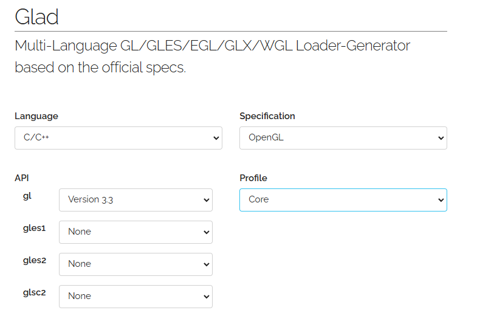

# Конспект по OpenGL
---
*все практические навыки отрабатываются в* **`opengl_playground`**

---

## Скачиваем основные библиотеки
1. **GLHF**: https://www.glfw.org/download.html
2. **GLAD** (Загрузчик OpenGL)


| Поле                   | Значение      | Что означает                                                                                                                 |
| ---------------------- | ------------- | ---------------------------------------------------------------------------------------------------------------------------- |
| **Language**           | `C/C++`       | Язык, на котором мы работаем - C).                                                                          |
| **Specification**      | `OpenGL`      | Спецификация API. Нас интересует классический OpenGL, а не ES (для мобильных) или WebGL.                                     |
| **gl**                 | `Version 3.3` | Версия OpenGL, которую хотим использовать. 3.3 — хороший выбор: достаточно мощная и при этом почти везде поддерживается. |
| **Profile**            | `Core`        | "Ядро" OpenGL — без устаревших функций (вроде `glBegin`, `glEnd`). Это современный стиль OpenGL.                             |
| **gles1/2**, **glsc2** | `None`        | Эти поля для других типов OpenGL (мобильный, встраиваемый). Нам они не нужны.                                                |


## GLAD
 это библиотека, которая загружает функции OpenGL в память из драйвера видеокарты. Без неё мы бы не смогли использовать такие функции, как glGenBuffers, glUseProgram, glVertexAttribPointer и т.д.

OpenGL — это абстрактный API, а не конкретная библиотека. Под Windows он реализован в opengl32.dll, но он поддерживает только OpenGL 1.1. Чтобы использовать более новые версии (например, 3.3), нужна библиотека, которая загрузит все нужные функции вручную из драйвера видеокарты. Именно это делает GLAD.


## Первоначальная структура тестового проекта на OpenGl

```
opengl_playground/
├── include/
│   ├── glad/
│   └── KHR/
│
├── src/
│   ├── glad.c
│   └── main.c
│
├── shaders/
│   ├── vertex.glsl - вершинный шейдер
│   └── fragment.glsl - фрагментный шейдер
│
├── libs/
│   └── glfw/
│
├── CMakeLists.txt
└── README.md

```

**vertex.glsl и fragment.glsl - что это?**
Допустим, мне надо нарисовать треугольник на экране. OpenGL сам не рисует, я должен описать ему:
1. Где находятся вершины фигуры (координаты)
2. Как закрасить пиксели внутри фигуры

Тут и работают шейдеры:
| Шейдер                              | Зачем нужен                                                  | Пример аналогии                       |
| ----------------------------------- | ------------------------------------------------------------ | ------------------------------------- |
| **Вершинный** (`vertex shader`)     | Обрабатывает каждую **вершину** — отвечает за позицию.       | Расставляет булавки на карте.         |
| **Фрагментный** (`fragment shader`) | Обрабатывает каждый **пиксель** внутри фигуры — задаёт цвет. | Раскрашивает области между булавками. |

Вершинный шейдер получает 3 точки -> рассчитывает, где они будут на экране.

Фрагментный шейдер берёт каждую точку внутри треугольника и задаёт ей цвет (например, красный).

**Вершинный шейдер**
```
layout (location = 0) in vec3 aPos;

void main() {
    gl_Position = vec4(aPos, 1.0);
}
```
- Работает на каждую вершину
- На вход получает ver3 - координаты точки
- Возвращает gl_Position - экранные координаты (в диапазоне от -1 до 1)

**Фрагментный шейдер**
```
out vec4 FragColor;

void main() {
    FragColor = vec4(0.8, 0.2, 0.3, 1.0);  // цвет фрагмента
}
```
- Работает на каждый фрагмент/пиксель, который попал внутрь примитива (треугольник в нашем случае)
- Возвращает цвет (ver4, где R, G, B, A - от 0 до 1)

**В итоге все работает вот так:**
- Передаем координаты треугольника.

- Вершинный шейдер обрабатывает каждую вершину.

- OpenGL растеризует (делит треугольник на пиксели).

- Фрагментный шейдер задаёт цвет каждому пикселю.

- Всё рисуется на экране.

---
**Непосредственно рисуем треугольник**
Хочется:
- Загружать и компилировать шейдеры
- Создавать и связывать VBO / VAO
- Отрисовывать треугольник на экране

Добавляем stc/main.c - основной файл программы, подключим его через CMakeLists.txt, и он будет собираться в OpenGL_Playground.exe


**Шаг 1: Создаем окно**
```C
#include <glad/glad.h> // подключает функции OpenGL (например, glClearColor, glDrawArrays)
#include <GLFW/glfw3.h> // библиотека GLFW - создаем окно и обрабатываем ввод
#include <stdio.h> // вывод ошибочек

int main()
{
    // Инициализация GLFW - glfwInit()
    if (!glfwInit())
    {
        fprintf(stderr, "Ошибка инициализации GLFW\n");
        return -1;
    }

    /*
        Настройка OpenGL-контекста
        - Указывает версию OpenGL, которую мы хотим: 3.3
        - CORE_PROFILE: значит, что используем только современные функции OpenGL,
          без устаревших (glBegin, glEnd...)
    */
    glfwWindowHint(GLFW_CONTEXT_VERSION_MAJOR, 3);
    glfwWindowHint(GLFW_CONTEXT_VERSION_MINOR, 3);
    glfwWindowHint(GLFW_OPENGL_PROFILE, GLFW_OPENGL_CORE_PROFILE);

    // Создание окна: w: 800, h: 600
    GLFWwindow* window = glfwCreateWindow(800, 600, "OpenGL Window", NULL, NULL);
    if (!window) {
        fprintf(stderr, "Ошибка создания окна\n");
        glfwTerminate();
        return -1;
    }

    // Подключение контекста - связывает окно с текущим потоком (чтобы OpenGL мог рисовать в него)
    glfwMakeContextCurrent(window);

    /*
        Инициализация GLAD:
        - GLAD загружает указатели на все функции OpenGL из драйвера видеокарты
        - Без него мы не сможем использовать glClear, glDrawArrays, etc
    */
    if (!gladLoadGLLoader((GLADloadproc)glfwGetProcAddress)) 
    {
        fprintf(stderr, "Ошибка инициализации GLAD\n");
        return -1;
    }

    /*
        Главный цикл:
        - glfwWindowShouldClose(window) — проверяет, нажал ли пользователь на крестик
        - glClearColor(...) — устанавливает цвет фона
        - glClear(...) — очищает экран этим цветом
        - glfwSwapBuffers(window) — показывает, что мы нарисовали (переключает кадры)
        - glfwPollEvents() — обрабатывает клавиши, мышь и т.д.
    */
    while (!glfwWindowShouldClose(window)) 
    {
        glClearColor(0.2f, 0.3f, 0.3f, 1.0f);
        glClear(GL_COLOR_BUFFER_BIT);

        glfwSwapBuffers(window);
        glfwPollEvents();
    }

    // Завершение
    glfwTerminate(); // освобождает ресурсы GLFW
    return 0;
}   
```

**Как собрать этот замечательный проект?**
1. переходим в корень проекта opengl_playground
2. запускаем команду:
   ```
   gcc src/main.c src/glad.c -Iinclude -Ilibs/glfw/include -Llibs/glfw/lib-mingw-w64 -lglfw3 -lopengl32 -lgdi32 -o OpenGL_Playground.exe
   ```
**Расшифровка**:
- `src/main.c src/glad.c` — твои исходники
- -`Iinclude` — директория, где лежит glad.h
- -`Ilibs/glfw/include` — где glfw3.h
- `-Llibs/glfw/lib-mingw-w64` — путь к библиотеке GLFW (libglfw3.a)
- `-lglfw3` — подключаем GLFW
- `-lopengl32` — подключаем OpenGL
- `-lgdi32` — нужна Windows (для рендеринга)
- `-o OpenGL_Playground.exe` — имя выходного файла

**Результат:** Всё получилось! но.. надо было только переключится с mingw32 на mingw64

---
**Шаг 2 - Добавим массим вершин и создадим VBO (начало для треугольничка)**

**Что мы делаем?**
- Опишем координаты трёх точек (вершин треугольника)
- Передадим их в видеокарту с помощью Vertex Buffer Object (VBO)
- Настроим Vertex Array Object (VAO) — это контейнер, который "помнит", как читать вершины

**Смотрим код:**
```C
    // === ВЕРШИНЫ ТРЕУГОЛЬНИКА ===
    float vertices[] = {
         0.0f,  0.5f, 0.0f,  // верхняя вершина
        -0.5f, -0.5f, 0.0f,  // нижняя левая
         0.5f, -0.5f, 0.0f   // нижняя правая
    };

    unsigned int VBO, VAO;

    // 1. Создаём VAO и VBO
    glGenVertexArrays(1, &VAO);
    glGenBuffers(1, &VBO);

    // 2. Активируем VAO
    glBindVertexArray(VAO);

    // 3. Привязываем VBO и передаём данные
    glBindBuffer(GL_ARRAY_BUFFER, VBO);
    glBufferData(GL_ARRAY_BUFFER, sizeof(vertices), vertices, GL_STATIC_DRAW);

    // 4. Настраиваем формат данных в VBO
    glVertexAttribPointer(
        0,              // location = 0 в вершинном шейдере
        3,              // по 3 float на вершину (x, y, z)
        GL_FLOAT,
        GL_FALSE,
        3 * sizeof(float),
        (void*)0
    );
    glEnableVertexAttribArray(0);

    // 5. Отвязываем всё (по желанию)
    glBindBuffer(GL_ARRAY_BUFFER, 0);
    glBindVertexArray(0);
```

**Пояснение:**
| Строка                               | Что делает                                             |
| ------------------------------------ | ------------------------------------------------------ |
| `float vertices[]...`                | Описывает координаты трёх вершин                       |
| `glGenBuffers` / `glGenVertexArrays` | Создаёт объекты на GPU                                 |
| `glBindBuffer`                       | Привязывает буфер как "текущий"                        |
| `glBufferData`                       | Копирует данные в видеопамять                          |
| `glVertexAttribPointer`              | Говорит, как читать вершины                            |
| `glEnableVertexAttribArray`          | Включает атрибут (вершину)                             |
| `glBindVertexArray(0)`               | Отвязывает VAO — на практике не обязателен, но полезен |

---
**Шаг 3.1 - Загрузка и компиляция шейдеров**

**Что мы делаем?**
- Создадим два текстовых файла:
  - shaders/vertex.glsl — для обработки вершин
  - shaders/fragment.glsl — для цвета пикселей
- Считаем их содержимое
- Скомпилируем, соединим и применим в OpenGL

**Шаг 3.2 - Добавляем в main.c загрузку и компиляцию шейдеров**
GLSL очень чувствителен к кодировке и лишним символам.
Файл шейдера должен начинаться строго с #version без BOM и без невидимых символов.
Рекомендуемая кодировка: UTF-8 без BOM.
Любой мусор (например, случайный символ А перед #version) вызывает ошибку компиляции.